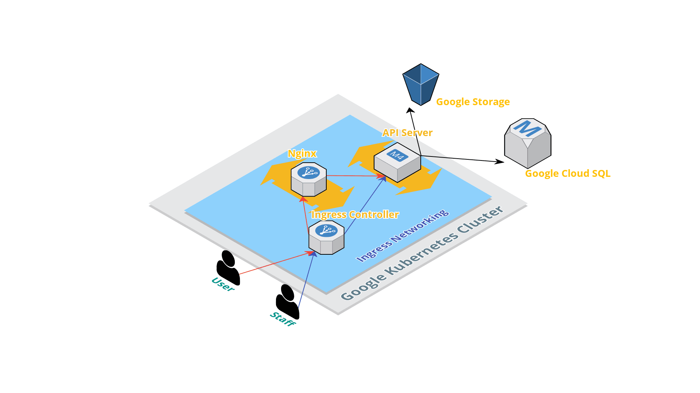

# Froggy's service


Project setup using [cookiecutter-django-vue](https://github.com/vchaptsev/cookiecutter-django-vue)

### Contribution

See our [contributing guide](CONTRIBUTING.md).

### Development

Create your own `.env` file at root, e.g. using `.env.example`:
```
$ sudo cp .env.example .env
```

Use `--build` to rebuild image, `-d` to run containers in the background :
```
$ docker-compose up --build
```

Use `-v` to clean volume while stop containers:
```
$ docker-compose down -v
```

### Deploy

Run the app in Kubernetes
The folder k8s-specifications contains the yaml specifications, this is for demo purpose, note the persistent volume
is not set for database.

Create secrets
```
$ kubectl create secret generic environs --from-env-file .env
```

Run the following command to create the deployments and services objects:
```
$ kubectl create -f k8s-specifications/
```
```
ingress.extensions/ingress created
deployment.extensions/api created
service/api-service created
deployment.extensions/postgres created
service/postgres created
deployment.extensions/nginx created
service/nginx-service created
```

Clean up
```
$ kubectl delete -f k8s-specifications/
```

### Architecture




### Licenses
* Copyright (C) 2019 - 2019 台北市議員邱威傑辦公室. All rights reserved.
* Distributed under the MIT

Media
* Distributed under the CC0 1.0 Universal

Data
* Try our API via [Swagger](https://service.froggychiu.com/api/swagger/)
* Distributed under the CC BY 4.0
